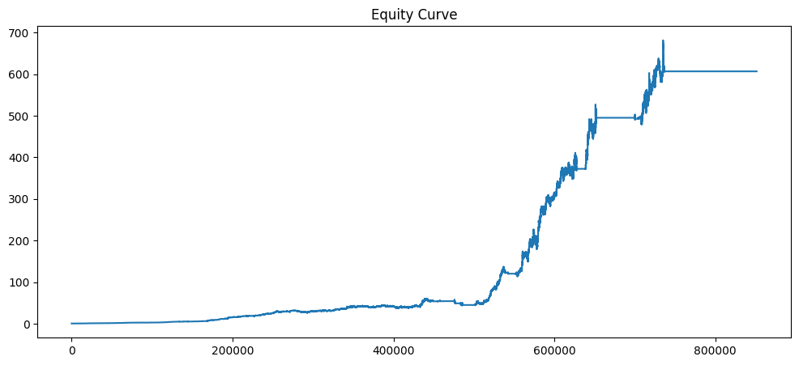
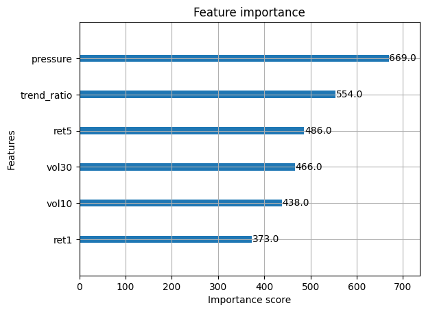

# 🧠 Smart Order Flow Alpha Engine  

**Institutional-Grade Quantitative Trading Research System**

---

## 🚀 Overview

An end-to-end quantitative trading system built on **BankNifty intraday data**, combining:

- Market microstructure feature engineering  
- Machine-learning alpha modeling  
- Professional risk management  
- Full backtesting pipeline  

**Final performance (out-of-sample):**

| Metric | Result |
|------|-------|
| Alpha AUC | ~0.61 |
| Sharpe Ratio | **2.59** |
| Max Drawdown | **-27%** |

---

## 🧱 System Architecture

```text
Market Data
   ↓
Feature Engineering (Microstructure Signals)
   ↓
ML Alpha Model (XGBoost)
   ↓
Signal Generation
   ↓
Risk Engine
   • Volatility Targeting
   • Drawdown Kill-Switch
   • Regime Cooldown
   ↓
Backtesting Engine
   ↓
Performance & Analytics
```


---

## 🔬 Key Components

### 🧪 Feature Engineering
- Returns: `ret1`, `ret5`
- Volatility: `vol10`, `vol30`
- **Price Pressure** (order-flow proxy)
- Trend regime detection: `trend_ratio`

### 🤖 Alpha Model
- Model: **XGBoost Classifier**
- Walk-forward cross-validation
- Feature importance analysis
- Directional return prediction

### 📊 Trading Strategy
- Probability-based trade signals
- Volatility-targeted position sizing
- Maximum leverage control
- Drawdown kill-switch
- Regime cooldown after losses

### 🛡 Risk Management
- Rolling volatility targeting  
- Exposure smoothing  
- Hard drawdown limits  
- Post-loss trading cooldown  

### 🧮 Backtesting
- Compounded equity curve  
- Sharpe, drawdown, performance metrics  
- Risk-adjusted evaluation  

---

## 📈 Final Performance Summary

| Metric | Value |
|------|------|
| Sharpe Ratio | **2.59** |
| Max Drawdown | **-27%** |
| Alpha Predictive Power (AUC) | ~0.61 |

---

## 🗂 Project Structure

```text
smart-orderflow-alpha/
│
├── notebooks/
│ ├── data_pipeline_check.ipynb
│ ├── eda.ipynb
│ ├── alpha_model.ipynb
│ └── backtest.ipynb ⭐ flagship
│
├── research/
│ └── feature_engineering/
│
├── data/
│ └── raw/
│
├── risk/ # future extensions
├── execution/ # future extensions
├── visualization/ # future extensions
└── README.md
```
> Note: Raw market data is excluded from this repository due to size constraints.

---

## 📊 Results Snapshot





## 🧭 Roadmap (Planned Extensions)

- Transaction cost & slippage modeling  
- Value-at-Risk & CVaR analytics  
- Live data ingestion & real-time simulation  
- Interactive performance dashboard (Streamlit)  

---

## 🧑‍💻 Author

**Niranjan Nair**  
Mechanical Engineering — IIT Bombay  
Quantitative Research & Trading Systems

---

## ⚠️ Disclaimer

This project is for educational & research purposes only.  
It does **not** constitute financial advice.


